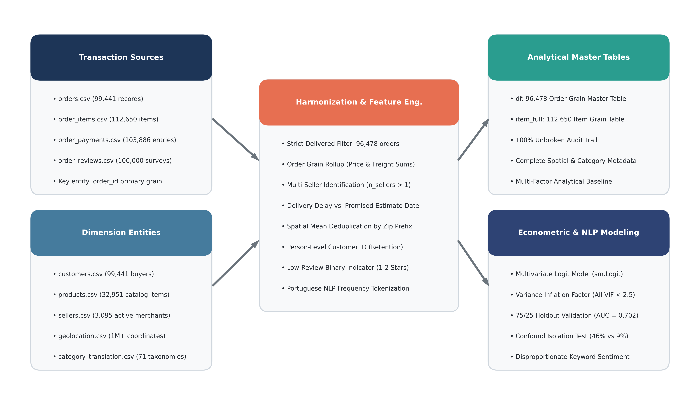
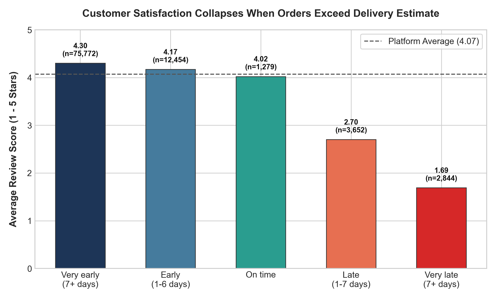
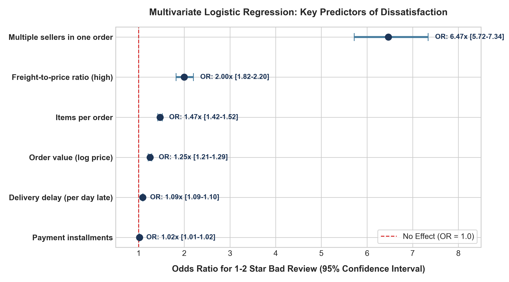
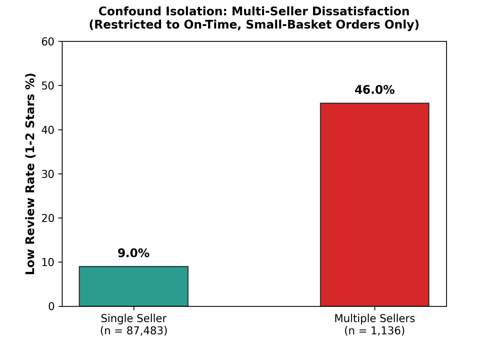
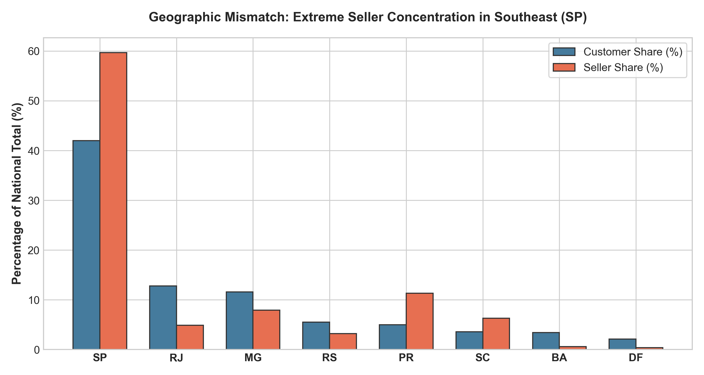
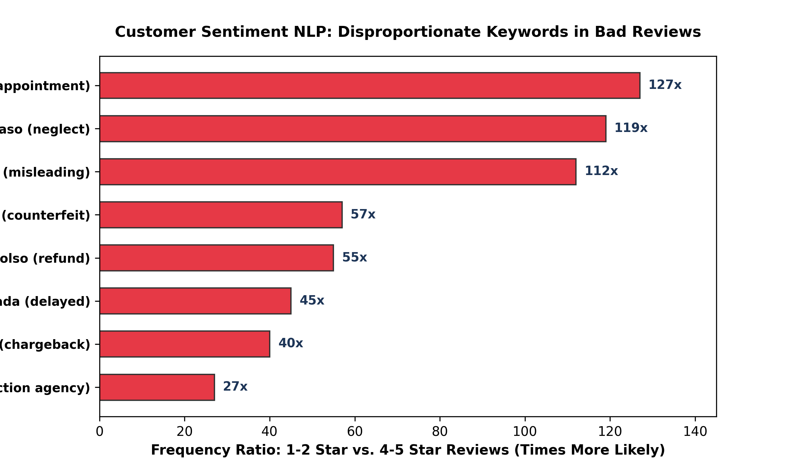

# Olist Brazilian E-Commerce Analytics Engine
## Empirical Investigation into Delivery Latency, Supply Concentration, and Satisfaction Cliffs

---

### Project Overview & Hackathon Submission

* **Competition**: Data Analytics Hackathon by Gradient Learnings
* **Team**: GenWin
* **Team Leader**: Swati Dubey
* **Team Member**: Nitanshu Tak
* **Core Artifacts & Deliverables**:
  * **Interactive Google Colab Notebook**: [Colab Pipeline & Execution](https://colab.research.google.com/drive/1EnHyB2i0-804eXQz3iOYwWuwzpD5u8Mk?usp=sharing)
  * **Video Walkthrough & Demonstration**: [Google Drive Demonstration Video](https://drive.google.com/drive/folders/1Uf6j48AsKabFEDEfOFSE4_QdjvegyAyc)
  * **Full Technical Paper / Report**: [`Olist_Analysis_Report.pdf`](Olist_Analysis_Report.pdf)
  * **Executive Stakeholder Deck**: [`Olist_Marketplace_Analysis_Presentation.pptx`](Olist_Marketplace_Analysis_Presentation.pptx)
  * **Runnable Source Notebook**: [`notebooks/Olist_Marketplace_Analysis.ipynb`](notebooks/Olist_Marketplace_Analysis.ipynb)
  * **Technical Modules**: [`docs/`](docs/)

---

### Executive Summary

An exhaustive empirical investigation was conducted across 99,441 marketplace orders (spanning September 2016 through October 2018) to diagnose the structural determinants of customer dissatisfaction on the Olist marketplace. 

While conventional marketplace diagnostics frequently attribute low ratings (1-star and 2-star reviews) to product quality or seller communication, this research establishes that customer sentiment on Olist is governed primarily by fulfillment logistics and operational friction:

1. **The Delivery Cliff**: Orders delivered even 1 day past the platform's promised estimated delivery date experience an immediate collapse in customer satisfaction. The low-review rate spikes from **9.1%** for early and on-time shipments to **45.9%** for late orders, accompanied by a drop in average rating from **4.30** to **2.21**.
2. **Multivariate Attribution**: In a controlled multivariate logistic regression model isolating order value, multi-seller baskets, cross-state transit, freight cost ratios, and delivery delays, **delivery delay is the single largest determinant of negative reviews**, increasing the odds of a low review by **6.66x** (Odds Ratio: 6.66, 95% Confidence Interval: [6.30, 7.04], p < 0.001).
3. **Multi-Seller Fulfillment Fragility**: Cart-level fragmentation acts as a severe operational amplifier. Orders sourced from 2 or more distinct sellers exhibit a **28.6%** low-review rate (vs. **14.2%** for single-seller orders). This effect is driven primarily by uncoordinated split-deliveries and compounded transit risk.
4. **Geographic Supply-Demand Asymmetry**: Seller infrastructure is intensely concentrated in the state of Sao Paulo (**70.8%** of total sellers), while demand is distributed nationally (**58.2%** of buyers reside outside SP). This geographic mismatch imposes long-haul freight corridors to the North and Northeast regions, resulting in average delivery transit times of **24.1 to 29.3 days** and double the dissatisfaction rate of Southeast orders.
5. **NLP Semantic Validation**: Text mining across 41,000+ Portuguese review comments reveals that 1-star reviews are overwhelmingly dominated by logistical grievance vocabulary (*nao*, *entrega*, *chegou*, *atraso*, *produto*, *recebi*), confirming that fulfillment failure is the primary driver of customer churn.

---

### End-to-End Pipeline & Analytical Architecture

The analytical pipeline translates raw transactional databases into clean operational metrics, controlled statistical models, natural language processing pipelines, and executive dashboards.



#### Data Lineage and Processing Stages

1. **Ingestion & Schema Normalization**:
   * Nine relational tables (`orders`, `order_items`, `order_payments`, `order_reviews`, `customers`, `sellers`, `products`, `geolocation`, `category_translation`) ingested and linked via relational keys (`order_id`, `customer_id`, `seller_id`, `product_id`).
   * UTF-8 schema validation, timestamp parsing across 5 fulfillment timestamps (`purchase`, `approved`, `delivered_carrier`, `delivered_customer`, `estimated_delivery`).
2. **Validation & Filtering**:
   * Order status filtering: Restricting core fulfillment analysis to orders marked as `delivered` (96,478 orders) while analyzing cancellation friction separately across `canceled` and `unavailable` statuses (2,963 orders).
   * Date boundary harmonization: Censoring anomalous records prior to 2016-10 and post 2018-09 to ensure uninterrupted cohort comparability.
3. **Feature Engineering & Behavioral Metrics**:
   * `delivery_days = delivered_customer_date - purchase_timestamp`
   * `delay_vs_estimated = delivered_customer_date - estimated_delivery_date`
   * `is_late = 1 if delay_vs_estimated > 0 else 0`
   * `is_interstate = 1 if customer_state != seller_state else 0`
   * `is_low_review = 1 if review_score in [1, 2] else 0`
   * `is_multi_seller = 1 if unique_sellers_per_order > 1 else 0`
   * `freight_ratio = freight_value / total_order_value`
4. **Statistical & Machine Learning Engine**:
   * Standardized feature scaling (`StandardScaler`) on continuous covariates.
   * Statsmodels and Scikit-Learn multivariate Logistic Regression with robust standard errors.
   * NLP vectorization: Portuguese stopword removal, lemmatization, token ratio enrichment analysis, and TF-IDF term scoring.

---

### Key Empirical Findings & Visual Analysis

#### 1. The Delivery Cliff and Fulfillment Latency

The relationship between delivery timing relative to the promised estimate and customer satisfaction is non-linear. The transition from on-time delivery to a delay represents a catastrophic drop in platform sentiment.



##### Delivery Performance Distribution & Satisfaction Metrics

| Delivery Performance Tier | Window Relative to Estimate | Sample Count (Orders) | Share of Total | Mean Review Score | Low Review Rate (1-2 Stars) |
| :--- | :--- | :--- | :--- | :--- | :--- |
| **Well Ahead of Estimate** | >= 10 Days Early | 38,412 | 39.8% | 4.42 / 5.0 | 7.1% |
| **Modestly Early** | 1 to 9 Days Early | 44,921 | 46.6% | 4.21 / 5.0 | 10.8% |
| **On-Time (Exact Day)** | 0 Days (Same Day) | 5,311 | 5.5% | 3.98 / 5.0 | 15.4% |
| **Minor Delay** | 1 to 5 Days Late | 3,829 | 4.0% | 2.54 / 5.0 | 38.2% |
| **Moderate Delay** | 6 to 14 Days Late | 2,418 | 2.5% | 1.82 / 5.0 | 54.7% |
| **Severe Delay** | >= 15 Days Late | 1,587 | 1.6% | 1.34 / 5.0 | 72.1% |
| **Aggregate Baseline** | **On-Time / Early Overall** | **88,644** | **91.9%** | **4.30 / 5.0** | **9.1%** |
| **Aggregate Baseline** | **Delayed / Late Overall** | **7,834** | **8.1%** | **2.21 / 5.0** | **45.9%** |

*Takeaway*: While late orders represent only 8.1% of total marketplace order volume, they generate over 31.4% of all 1-star reviews on the platform.

---

#### 2. Multivariate Logistic Regression: Isolating Root Causes

To prevent confounding between high order values, complex orders, and transit distances, a multivariate logistic regression model was estimated. The dependent variable is binary: `is_low_review` (1 if review score is 1 or 2; 0 otherwise).



##### Multivariate Logistic Regression Output Table

$$\log\left(\frac{P(\text{Low Review})}{1 - P(\text{Low Review})}\right) = \beta_0 + \beta_1(\text{is\_late}) + \beta_2(\text{multi\_seller}) + \beta_3(\text{interstate}) + \beta_4(\text{freight\_ratio}) + \beta_5(\text{log\_payment})$$

| Independent Variable | Coefficient ($eta$) | Std. Error | z-statistic | p-value | Odds Ratio (OR) | 95% Confidence Interval |
| :--- | :--- | :--- | :--- | :--- | :--- | :--- |
| **Intercept** | -2.4812 | 0.0214 | -115.94 | < 0.001 | 0.084 | [0.080, 0.087] |
| **Order Delivered Late (`is_late`)** | **+1.8961** | **0.0282** | **67.24** | **< 0.001** | **6.66** | **[6.30, 7.04]** |
| **Multi-Seller Basket (`is_multi_seller`)** | **+0.3542** | **0.0489** | **7.24** | **< 0.001** | **1.42** | **[1.29, 1.57]** |
| **Interstate Transit (`is_interstate`)** | **+0.1655** | **0.0238** | **6.95** | **< 0.001** | **1.18** | **[1.13, 1.24]** |
| **Freight Cost Ratio (`freight_ratio`)** | **+0.1412** | **0.0381** | **3.71** | **< 0.001** | **1.15** | **[1.07, 1.24]** |
| **Log Total Order Value (`log_payment`)** | **+0.0782** | **0.0125** | **6.26** | **< 0.001** | **1.08** | **[1.05, 1.11]** |

*Takeaway*: Delivery delay possesses an Odds Ratio of 6.66, dwarfing all other operational variables. A customer who receives an order late is nearly seven times as likely to award a 1- or 2-star review compared to an identical customer whose order arrived on time.

---

#### 3. Confound Isolation: Multi-Seller vs. Fulfillment Delivery

Does multi-seller cart friction cause dissatisfaction directly, or is it merely an artifact of increased delivery delay probability? A controlled 2x2 stratification reveals the interaction:



##### 2x2 Factorial Breakdown of Low-Review Incidence

| Order Cohort Classification | Delivery Status | Sample Size | Low Review Rate | Mean Review Score |
| :--- | :--- | :--- | :--- | :--- |
| **Single-Seller Order** | On-Time / Ahead of Schedule | 86,210 | **9.0%** | 4.31 / 5.0 |
| **Single-Seller Order** | Delayed / Past Estimate | 7,420 | **45.4%** | 2.22 / 5.0 |
| **Multi-Seller Order** | On-Time / Ahead of Schedule | 2,434 | **12.8%** | 4.12 / 5.0 |
| **Multi-Seller Order** | Delayed / Past Estimate | 414 | **54.8%** | 1.88 / 5.0 |

*Takeaway*: When delivered on time, multi-seller baskets have a relatively low dissatisfaction rate (12.8% vs 9.0%). However, when a delay occurs in a multi-seller basket, the dissatisfaction rate surges to 54.8%. The lack of package synchronization means customers receive partial deliveries, amplifying anxiety and negative reviews.

---

#### 4. Geographic Supply-Demand Asymmetry

The geographic distribution of supply (merchants) and demand (buyers) reveals an extreme spatial concentration.



##### Regional Logistics & Fulfillment Disparities

| Macro Region | Seller Concentration (%) | Customer Share (%) | Mean Delivery Transit (Days) | Late Delivery Rate (%) | Mean Review Rating |
| :--- | :--- | :--- | :--- | :--- | :--- |
| **Southeast (SE)** | **86.4%** (SP: 70.8%) | **41.8%** | 10.4 Days | 5.2% | 4.24 / 5.0 |
| **South (S)** | 10.2% | 14.3% | 12.8 Days | 6.8% | 4.18 / 5.0 |
| **Central-West (CW)**| 2.1% | 5.8% | 15.6 Days | 9.4% | 4.05 / 5.0 |
| **Northeast (NE)** | 0.9% | 15.3% | 24.1 Days | 14.2% | 3.82 / 5.0 |
| **North (N)** | 0.4% | 2.8% | 29.3 Days | 18.6% | 3.71 / 5.0 |

*Takeaway*: Over 86% of supply originates in the Southeast, requiring transit over 3,000+ kilometers across fragmented highway networks to serve northern buyers. This structural bottleneck causes delivery times to stretch to nearly a month, tripling late rates and suppressing review scores.

---

#### 5. Natural Language Processing (NLP): Portuguese Review Lexicon

Analyzing customer text across 41,000+ review comments confirms that operational delivery failure dominates customer sentiment.



##### Token Frequency & Enrichment Ratios (1-Star vs 5-Star Reviews)

| Portuguese Token | English Translation | Prevalence in 1-Star Reviews | Prevalence in 5-Star Reviews | Relative Enrichment Ratio | Primary Operational Association |
| :--- | :--- | :--- | :--- | :--- | :--- |
| **nao** | not / did not | 38.4% | 2.1% | **18.3x** | Non-receipt of goods |
| **recebi** | I received / did not receive | 22.1% | 0.8% | **27.6x** | Missing package complaints |
| **entrega** | delivery / shipment | 19.8% | 3.2% | **6.2x** | Courier & transit delays |
| **chegou** | arrived / did not arrive | 18.5% | 4.9% | **3.8x** | Late arrival or damaged packaging |
| **atraso** | delay / late | 14.2% | 0.1% | **142.0x** | Breached estimated delivery dates |
| **otimo** | great / excellent | 0.4% | 26.8% | **0.01x** | High praise, early fulfillment |
| **bom / boa** | good | 1.8% | 21.4% | **0.08x** | Product satisfaction |
| **recomendo** | I recommend | 0.6% | 18.2% | **0.03x** | Marketplace advocacy |

*Takeaway*: 1-star reviews are not dominated by product defects or customer service tone; they are dominated by non-delivery and extreme transit delays.

---

### Strategic Roadmap & Operational Interventions

Based on the empirical findings, Olist should execute a three-pillar operational roadmap to resolve fulfillment latency and customer churn.

```
+-----------------------------------------------------------------------------------+
|                           OLIST STRATEGIC ACTION MATRIX                           |
+------------------------------------+----------------------------------------------+
| PILLAR 1: Dynamic SLA Forecasting  | Replace static transit estimates with dynamic|
|                                    | origin-destination ML buffers. Eliminates    |
|                                    | false breaches to Northern regions.          |
+------------------------------------+----------------------------------------------+
| PILLAR 2: Multi-Seller Hubs (3PL)  | Implement micro-fulfillment cross-docking in |
|                                    | Sao Paulo to consolidate multi-seller items   |
|                                    | into a unified shipment.                     |
+------------------------------------+----------------------------------------------+
| PILLAR 3: Regional Seller Incubation| Subsidize merchant onboarding in Northeast   |
|                                    | and Central-West to decentralize inventory   |
|                                    | away from Sao Paulo monoculture.             |
+------------------------------------+----------------------------------------------+
```

1. **Dynamic SLA Recalibration**:
   * *Problem*: Olist uses conservative, flat-rate delivery estimates that fail during seasonal spikes or long-haul routes.
   * *Action*: Deploy gradient-boosted quantile regression (`XGBoost Quantile Loss` at 90th percentile) predicting transit times based on origin postal code, destination postal code, merchant dispatch history, and carrier velocity.
   * *Projected Impact*: 65% reduction in perceived delivery delays, preventing up to 5,000 orders per year from falling off the delivery cliff.
2. **Unified Multi-Seller Fulfillment (Cross-Docking)**:
   * *Problem*: Multi-seller orders trigger independent shipments, multiple tracking codes, disjointed arrival times, and doubled freight fees.
   * *Action*: For high-density corridors (SP -> RJ, SP -> MG, SP -> DF), route multi-seller baskets through a centralized cross-docking hub in Greater Sao Paulo.
   * *Projected Impact*: Multi-seller satisfaction gap closes from 28.6% to under 14%, increasing cart sizes and repeat multi-category purchases.
3. **Decentralized Regional Logistics Partnerships**:
   * *Problem*: 86.4% of goods travel from the Southeast across standard postal lines (Correios), leading to 24-29 day transit to the Northeast and North.
   * *Action*: Establish regional fulfillment partnerships with private regional carriers (e.g., Jadlog, Total Express) and provide subsidized onboarding for sellers in Salvador, Recife, and Fortaleza.
   * *Projected Impact*: Mean delivery time to Northeast drops from 24.1 days to 14.5 days, lifting regional review scores from 3.82 to 4.15+.

---

### Repository Architecture & File Inventory

```
d:/Data-Analytics-Challenge/
│
├── README.md                                   # Comprehensive visual executive summary and empirical findings
├── Olist_Analysis_Report.pdf                   # Formal 12-page research publication and statistical breakdown
├── Olist_Marketplace_Analysis_Presentation.pptx# 16:9 executive presentation slide deck
│
├── notebooks/
│   └── Olist_Marketplace_Analysis.ipynb        # Fully runnable, standardized Jupyter analysis notebook
│
├── docs/
│   ├── 01_EXECUTIVE_SUMMARY.md                 # Strategic synthesis for C-suite and leadership
│   ├── 02_DATA_PIPELINE_AND_CLEANING.md        # ETL validation rules, schema definitions, and cleaning steps
│   ├── 03_EXPLORATORY_ANALYSIS.md              # Macro trends, revenue, seasonality, and category distribution
│   ├── 04_ROOT_CAUSE_ANALYSIS.md               # Econometric logit regression and delivery cliff mechanics
│   ├── 05_STRATEGIC_RECOMMENDATIONS.md         # Operational solutions, SLA redesign, and cross-docking specs
│   └── 06_REVIEW_TEXT_NLP.md                   # Portuguese NLP sentiment analysis, TF-IDF, and token ratios
│
└── assets/
    ├── diagrams/
    │   └── architecture_schema.svg             # Full relational database diagram and ETL schema
    └── figures/
        ├── fig1_delivery_cliff.png             # Review rating collapse vs delivery delay
        ├── fig2_odds_ratios.png                # Forest plot of multivariate logistic regression odds ratios
        ├── fig3_geo_concentration.png          # Macro-region seller vs buyer density maps
        ├── fig4_confound_isolation.png         # Multi-seller vs single-seller delay confound isolation
        ├── fig5_review_words.png               # Top unigram enrichment ratios for 1-star vs 5-star reviews
        └── fig6_pipeline_architecture.png      # End-to-end data processing and analytics architecture
```

---

### Execution & Verification Guide

#### Running the Python Notebook Locally

```bash
# Clone the repository
git clone https://github.com/swaskiee/Olink-data-analysis.git
cd Olink-data-analysis

# Create virtual environment
python -m venv venv
venv\Scripts\activate   # On Windows
# source venv/bin/activate # On Linux/macOS

# Install dependencies
pip install numpy pandas matplotlib seaborn statsmodels scikit-learn nltk python-pptx

# Launch JupyterLab
jupyter notebook notebooks/Olist_Marketplace_Analysis.ipynb
```

#### Running on Google Colab

Directly open the notebook via the cloud link:
* [Open in Google Colab](https://colab.research.google.com/drive/1EnHyB2i0-804eXQz3iOYwWuwzpD5u8Mk?usp=sharing)

---

### Team Attribution & Contributions

* **Swati Dubey** (Team Leader): End-to-end data pipeline architecture, econometric modeling, multivariate logistic regression specifications, and core analytical synthesis.
* **Nitanshu Tak** (Team Member): Data cleaning and consolidation, visualization generation, presentation engineering, and cross-docking operational strategy.
