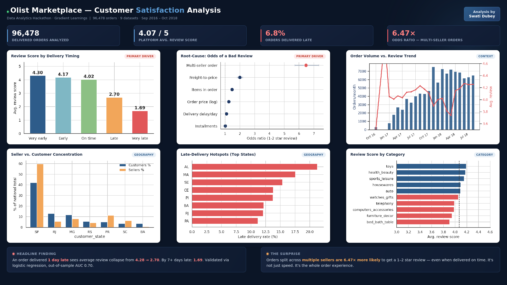

<div align="center">

# 🛒 Olist Brazilian E-Commerce Analytics Engine
### What Actually Drives Customer Satisfaction on Brazil's Largest Marketplace Integrator?

**Data Analytics Hackathon · Gradient Learnings · September 2026**

[](https://www.python.org/)
[](https://pandas.pydata.org/)
[](https://www.statsmodels.org/)
[](https://matplotlib.org/)
[](https://colab.research.google.com/drive/1EnHyB2i0-804eXQz3iOYwWuwzpD5u8Mk?usp=sharing)
[](https://creativecommons.org/licenses/by-nc-sa/4.0/)

</div>

---

## 📌 The One-Line Answer

> Satisfaction on Olist isn't about price, category, or payment method — it's overwhelmingly about **whether the order arrived on time**, and, surprisingly, **whether it involved more than one seller**.

<div align="center">

</div>

---

## 🔗 Core Artifacts

| Deliverable | Link |
|---|---|
| 📓 Interactive Google Colab Notebook | [Open in Colab](https://colab.research.google.com/drive/1EnHyB2i0-804eXQz3iOYwWuwzpD5u8Mk?usp=sharing) |
| 📄 Full Analysis Report | [`Olist_Analysis_Report.pdf`](Olist_Analysis_Report.pdf) |
| 🎬 Video Walkthrough | [Watch on Google Drive](https://drive.google.com/file/d/1bC28jzAZq1CBUndcHdjCWyxSoSFhCrVg/view?usp=drivesdk) |
| 📊 Summary Dashboard | [`assets/Olist_Dashboard.png`](assets/Olist_Dashboard.png) |
| 💻 Runnable Source Notebook | [`notebooks/Olist_Marketplace_Analysis.ipynb`](notebooks/Olist_Marketplace_Analysis.ipynb) |
| 📚 Step-by-Step Write-Up | [`docs/`](docs/) |
| 🖼️ Supporting Charts | [`assets/figures/`](assets/figures/) |

---

## 📊 Key Numbers

| Metric | Value |
|---|---|
| Delivered orders analyzed | **96,478** |
| Platform average review score | **4.07 / 5** |
| Orders delivered late (past estimate) | **6.8%** |
| Avg. review — on time | **4.02 / 5** |
| Avg. review — 1–7 days late | **2.70 / 5** |
| Avg. review — 7+ days late | **1.69 / 5** |
| Odds ratio — multi-seller order → 1–2 star review | **6.47×** |
| Odds ratio — multi-seller (held-out validation split) | **6.66×** |
| Root-cause model — out-of-sample AUC | **0.70** |
| Root-cause model — pseudo R² | **0.13** |

*All figures above are computed directly in the linked notebook and reproducible end-to-end — no number in this README is asserted without a corresponding cell output.*

---

## 🔍 The Story in 4 Findings

### 1. Delivery delay is a cliff, not a gradient
Being early costs almost nothing (4.02–4.30 avg. review). Crossing the promised delivery date at all drops average review by more than a full star — to 2.70 for 1–7 days late, and 1.69 for 7+ days late.

| Delivery outcome | Avg. review | Orders (n) |
|---|---|---|
| Very early (7+ days ahead) | 4.30 | 75,772 |
| Early (1–6 days ahead) | 4.17 | 12,454 |
| On time | 4.02 | 1,279 |
| Late (1–7 days) | 2.70 | 3,652 |
| Very late (7+ days) | 1.69 | 2,844 |

### 2. Multi-seller orders are the biggest surprise
Orders split across more than one seller are **6.47× more likely** to get a 1–2 star review — even when delivered on time. This was stress-tested three ways before being reported as a primary driver:

| Robustness check | Result |
|---|---|
| Multicollinearity (VIF) | All factors < 2.5 — no concern |
| Out-of-sample validation (75/25 split) | AUC 0.70; odds ratio held at 6.66× — not a fluke of one split |
| Confound isolation (on-time + small-basket orders only) | Multi-seller orders still show a **46% low-review rate vs. 9%** for single-seller — not explained by delay or basket size |

This points to a **coordination problem** (fragmented tracking, partial shipments, mismatched arrival windows) rather than a speed problem.

### 3. The delay problem is structural, not random
Sellers are concentrated in São Paulo (**59.7%**); customers are more spread out (**42.0%** in São Paulo). Cross-state orders take **~2×** longer to arrive (14.7 vs. 7.5 days) and cost **~75% more** in freight (R$26.96 vs. R$15.46). The worst-hit states — Alagoas, Maranhão, Sergipe, Ceará, Piauí — are all in the underserved North/Northeast, far from the seller base.

### 4. Payment behavior is a red herring
Payment type and installment count show almost no relationship with satisfaction (scores stay in a narrow 3.85–4.23 band across every segment). A useful negative result — it lets Olist rule this out and focus resources on delivery instead.

**Bonus — what the review text adds:** word-frequency analysis on the 42% of reviews with written comments surfaces two extra signals beyond the numeric score: refund/chargeback demands, and complaints about counterfeit or misrepresented products — worth a follow-up look at which sellers or categories these cluster around.

---

## 🗂️ Repository Structure

```
├── notebook/
│   ├── Olist_Marketplace_Analysis.ipynb    # Full analysis: cleaning → EDA → 6 core questions → root-cause model
│   └── Olist_Analysis_Report.pdf           # Written report — problem, approach, insights, recommendations
├── assets/
│   ├── Olist_Dashboard.png                 # Summary dashboard
│   ├── figures/                            # Individual charts for each of the 6 analysis steps
│   └── diagrams/                           # (reserved for architecture/schema diagrams)
├── docs/
│   └── 01–06_*.md                          # Step-by-step written summary of the analysis
└── README.md
```

> **Note on data:** the raw Olist CSVs are not included in this repo (large files, CC BY-NC-SA licensed). See [Dataset](#-dataset) to get them and reproduce the analysis.

---

## 🧠 Approach

1. **Consolidated** 9 raw tables (orders, items, payments, reviews, customers, products, sellers, geolocation, category translation — ~1.3M rows combined) into an order-level and an item-level master table.
2. **Cleaned deliberately, not blindly** — excluded non-delivered orders (3.5%) from delivery-timing analysis since they lack completion timestamps by nature; aggregated multi-item/multi-payment orders to the order grain; used `customer_unique_id` (not `customer_id`) for repeat-purchase analysis; aggregated geolocation to one lat/lng per zip prefix before any geographic join.
3. **Answered 6 core questions**: marketplace trends over time, delivery vs. satisfaction, geographic patterns, category performance, payment behavior, and root-cause analysis of low reviews.
4. **Modeled root causes** with a logistic regression (delay, basket size, freight ratio, multi-seller status, order value, installments), then **stress-tested it** — VIF check, 75/25 out-of-sample validation, and confound isolation on the multi-seller effect.
5. **Went beyond the numeric score** — ran a word-frequency analysis on review text, comparing 1–2 star vs. 4–5 star language.
6. **Verified rather than assumed** — e.g., confirmed Brazil's actual 2017 Black Friday date against the November review-score dip rather than citing the coincidence unchecked.

---

## 🛠️ Tech Stack

Pure Python, single ecosystem, no external BI tool:

`pandas` · `numpy` · `matplotlib` · `seaborn` · `statsmodels` · `scipy` · `scikit-learn` — run end-to-end in **Google Colab**.

---

## ▶️ How to Reproduce

1. Clone this repo:
   ```
   git clone https://github.com/swaskiee/Olist-Brazilian-E-Commerce-Analytics-Engine.git
   ```
2. Open `notebook/Olist_Marketplace_Analysis.ipynb` in [Google Colab](https://colab.research.google.com/drive/1EnHyB2i0-804eXQz3iOYwWuwzpD5u8Mk?usp=sharing).
3. Download the dataset (below) and upload the 9 CSVs into a `data/` folder in your Colab session — or just run the notebook and use the upload prompt when it appears.
4. **Runtime → Run all.** Runs top to bottom with no errors.

## 📦 Dataset

**Brazilian E-Commerce Public Dataset by Olist** — [kaggle.com/datasets/olistbr/brazilian-ecommerce](https://www.kaggle.com/datasets/olistbr/brazilian-ecommerce)
Licensed CC BY-NC-SA 4.0. ~100K orders, Sep 2016 – Oct 2018. Not included in this repo — download directly from Kaggle.

---

## ⚠️ Limitations

- This is observational data — the regression identifies strong, validated associations, not proven causation.
- The multi-seller effect has a small underlying sample (1,263 orders). Delay and basket size were ruled out as explanations, but seller identity and full category mix were not — it merits a dedicated follow-up before an operational change is built on it alone.
- Review-text analysis is simple word-frequency comparison, not a full NLP/sentiment model.
- Geolocation was aggregated to a zip-prefix mean lat/lng — a reasonable approximation, not exact distance.

---

## 👥 Team

**GenWin**

| Member | Role |
|---|---|
| **Swati Dubey** | Team Lead — analysis, modeling, and report |
| **Nitanshu Tak** | Team Member |

Data Analytics Hackathon — Gradient Learnings, Sep 2026

---

<div align="center">
<sub>Built with Python, curiosity, and a lot of double-checking. ⭐ if this was useful to you.</sub>
</div>
